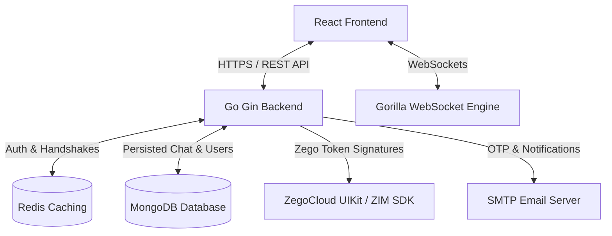

#  DistributionChatSystem-VC

A high-performance, real-time distribution chat system featuring instant text messaging, presence tracking, and premium voice/video calling capabilities.


---

##  Live Deployments

*   **Frontend (UI):** [https://distribution-chat-system-vc-vcoa.vercel.app/](https://distribution-chat-system-vc-vcoa.vercel.app/) (Hosted on Vercel)
*   **Backend (API Server & WebSockets):** [https://distributionchatsystem-vc.onrender.com](https://distributionchatsystem-vc.onrender.com) (Hosted on Render)

---

##  Key Features

*   **Real-Time Chatting:** Instant, bidirectional message delivery using a custom **WebSocket** layer.
*   **Voice & Video Calls:** 1-on-1 calls with WhatsApp-like call invitation alerts and ringtones, built using the **ZegoCloud UIKit Prebuilt** and **ZIM SDK**.
*   **Secure Authentication:** JWT-based login, refresh token rotation, and secure profile management.
*   **Email OTP Verification:** Secure signups and password recovery utilizing SMTP email verification (via `gomail`).
*   **Presence & Status Tracking:** Real-time online/offline indicators and "last seen" timestamps powered by **Redis**.
*   **User Search & History:** Quick search for users and comprehensive chat history retrieval from **MongoDB**.
*   **Modern UI:** Clean, responsive, glassmorphic design utilizing **Tailwind CSS v4** and modern React patterns.

---

##  Architecture Overview

The application is split into a Go-based backend API / WebSocket server and a React single-page application frontend.



---

##  Technology Stack

### Backend
*   **Language:** Go (v1.25)
*   **Web Framework:** [Gin Gonic](https://github.com/gin-gonic/gin) (Router & Middleware)
*   **WebSocket Engine:** [Gorilla WebSocket](https://github.com/gorilla/websocket)
*   **Database:** [MongoDB Go Driver](https://go.mongodb.org/mongo-driver) (Primary message & user store)
*   **Cache & Session Store:** [go-redis](https://github.com/go-redis/redis/v8) (User presence state, last seen, and OTP keys)
*   **Security:** `golang.org/x/crypto/bcrypt` (Password hashing) & `golang-jwt/jwt/v5` (Access/Refresh Tokens)
*   **Email Delivery:** `gopkg.in/gomail.v2` (OTP dispatch)

### Frontend
*   **Core Framework:** React (v19)
*   **Build Tool:** Vite
*   **Styling:** Tailwind CSS (v4)
*   **Routing:** React Router DOM (v7)
*   **Communication:** Axios (HTTP) & Native WebSockets (Real-time events)
*   **RTC Calling & Signaling:** `@zegocloud/zego-uikit-prebuilt` & `zego-zim-web`

---

##  Project Structure

```text
DistributionChatSystem-VC-New/
├── backEnd/                      # Go Backend Project
│   ├── controllers/              # HTTP Request Controllers (Auth, Messages, Calls)
│   ├── database/                 # Database connectors (MongoDB & Redis)
│   ├── middleware/               # Auth middlewares (JWT verification)
│   ├── models/                   # Go BSON/JSON Models (User, Message, Conversation)
│   ├── routes/                   # Routing configuration & endpoints definitions
│   ├── utils/                    # Helper packages
│   ├── websocket/                # WebSocket connection registry & hub
│   ├── .env                      # Backend environment variables
│   ├── go.mod                    # Go module dependencies
│   ├── go.sum                    # Go module checksums
│   └── main.go                   # Backend Entry Point
│
├── frontEnd/                     # React Frontend Project
│   ├── public/                   # Static assets (icons, images)
│   ├── src/
│   │   ├── assets/               # Styled components assets
│   │   ├── components/           # Reusable UI widgets
│   │   │   ├── call/             # Calling indicators (IncomingCallBanner)
│   │   │   ├── chat/             # Chat panels (ChatArea, Sidebar, Search)
│   │   │   └── InputField/       # Custom forms UI
│   │   ├── pages/                # Main Screen Pages (Login, Chat, OTP, Register)
│   │   ├── services/             # API clients (Auth, WebSocket, Push notifications)
│   │   ├── utils/                # Crypto & ZegoCloud initializers
│   │   ├── App.jsx               # React Routing Hub
│   │   ├── index.css             # Tailwind imports and theme styling
│   │   └── main.jsx              # React Entry Point
│   ├── .env                      # Global Frontend env parameters
│   ├── .env.local                # Local Frontend env parameters (including Signatures)
│   ├── .env.production           # Production Frontend env parameters
│   ├── package.json              # NPM dependencies & build scripts
│   └── vite.config.js            # Vite compiler configuration
│
├── vercel.json                   # Root Vercel static build routing
└── README.md                     # Project documentation
```

---

##  Environment Configurations

To run the project locally, set up the following environment configuration files:

### Backend Configuration (`backEnd/.env`)
```ini
# Database URIs
MONGO_URI=your_mongodb_connection_string
DATABASE_NAME=chatapp

# Redis Connection Details
REDIS_ADDR=your_redis_host:port
REDIS_PASSWORD=your_redis_password
REDIS_DB=0

# ZegoCloud Configurations (For Server-Side Token Generation)
ZEGO_APP_ID=your_zegocloud_app_id
ZEGO_SERVER_SECRET=your_zegocloud_server_secret

# JWT Token Secrets
ACCESS_SECRET=your_jwt_access_secret_key
REFRESH_SECRET=your_jwt_refresh_secret_key

# SMTP Credentials (For OTP Emails)
EMAIL=your_sender_gmail@gmail.com
EMAIL_PASSWORD=your_app_password

# Server Port
PORT=8080
```

### Frontend Configuration (`frontEnd/.env.local` or `.env`)
```ini
# API URLs
VITE_API_URL=http://localhost:8080
VITE_WS_URL=ws://localhost:8080

# ZegoCloud Configurations (For Client Calling Integration)
VITE_ZEGO_APP_ID=your_zegocloud_app_id
VITE_ZEGO_SERVER_SECRET=your_zegocloud_server_secret
VITE_ZEGO_APP_SIGN=your_zegocloud_app_signature
```

---

##  Getting Started (Local Development)

### Prerequisites
*   [Go 1.25+](https://go.dev/dl/) installed.
*   [Node.js (v18+) & NPM](https://nodejs.org/) installed.
*   A running instance of [MongoDB](https://www.mongodb.com/try/download/community) (local or Atlas cluster).
*   A running instance of [Redis](https://redis.io/download).

### 1. Run the Backend
Navigate to the `backEnd` directory:
```bash
cd backEnd
```
Install Go packages:
```bash
go mod tidy
```
Start the Go application server:
```bash
go run main.go
```
The backend API server will run on `http://localhost:8080`.

### 2. Run the Frontend
Open a new terminal session and navigate to the `frontEnd` directory:
```bash
cd frontEnd
```
Install node dependencies:
```bash
npm install
```
Start the Vite development web server:
```bash
npm run dev
```
The application will be accessible at `http://localhost:5173`.

---

##  Design and Visuals

The client-side layout is responsive, fluid, and modern:
*   **Vibrant Accent Coloring:** Dark theme optimization alongside customizable profile avatars.
*   **Intuitive Panels:** Side-by-side search integration, quick chat toggle, and real-time active status dots.
*   **Full Screen RTC Calls:** Zero lag video overlay panels built using WebRTC streams optimized by ZegoCloud.

---

##  License

This project is open-source and available under the MIT License.
